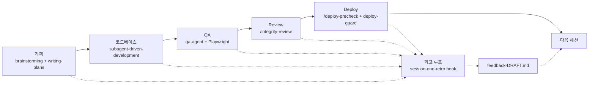
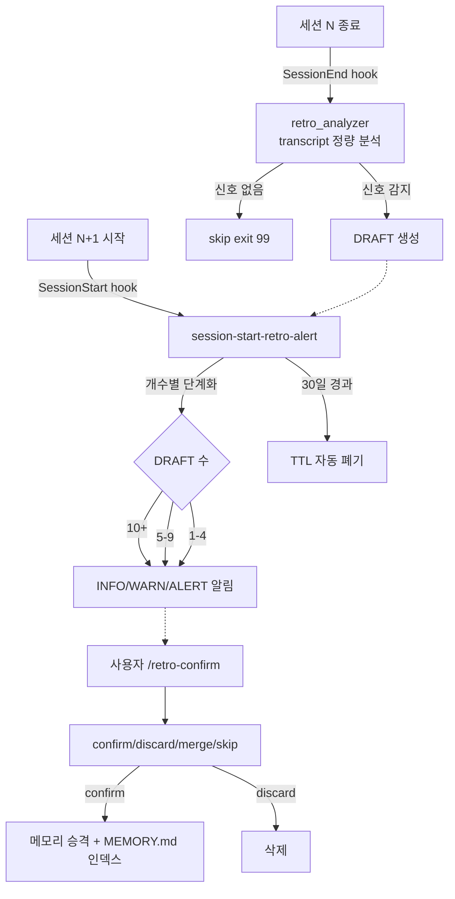

# agent-infra

`~/.claude/` 글로벌 인프라 — Claude Code 6단계 dev 워크플로우(회고/기획/코드/QA/Review/Deploy)를 hooks + agents + skills 로 자동·반자동 수행한다.

## 전략

### 1. 6단계 분리 + 페르소나 라우팅

각 단계마다 책임지는 도구·페르소나·산출물 위치를 명시적으로 분리한다. 영역을 벗어나는 요청을 받으면 적절한 페르소나로 전환하도록 사용자에게 묻는다.

| 단계 | 페르소나 | 산출물 위치 |
|---|---|---|
| 기획 | `superpowers:brainstorming` → `writing-plans` | `docs/{specs,prd,plans,tasks}/` |
| 코드베이스 | `superpowers:subagent-driven-development` | source files + `docs/tasks/` 자동 토글 |
| QA | `qa-agent` sub-agent (Playwright MCP) | `docs/reports/{qa,bugs}/` |
| Review | `/integrity-review` (code-review → review-agent) | `docs/reports/reviews/` |
| Deploy | `/deploy-precheck` + `deploy-guard` hook | `docs/reports/deploy/` |
| 회고 | `session-end-retro` hook + `/retro-confirm` skill | `~/.claude/projects/<dir>/memory/feedback-*.md` |

### 2. Hybrid 거버넌스 — 감시는 hook, 행위는 skill

자동 결정은 작고 안전한 것만, **비가역 결정은 항상 사용자**가 한다.

- **Hook (자동)**: SessionStart/End, PreToolUse, PostToolUse, SubagentStop — 모두 silent-fail 정책. 절대 워크플로우 차단 금지(`exit 0` 보장).
- **Skill (사용자 호출)**: 메모리 승격, 배포 토큰 발급, 리뷰 verdict 같은 비가역 행위는 명시 동의 필요.

### 3. 회고 학습 루프

세션이 끝나면 hook이 transcript를 분석해 신호(중복 read, tool error, 사용자 정정, verify→change)를 잡고 `-DRAFT.md`로 후보 메모리를 만든다. 다음 세션 시작 시 단계화된 알림이 뜨고, 사용자는 `/retro-confirm`으로 일괄 검토 후 진짜 가치 있는 신호만 메모리로 승격한다. 30일 방치 시 TTL로 자동 폐기.

## 워크플로우 도식

### 6단계 시퀀스



### 회고 학습 루프



## 구조

- `hooks/` — 7개 Claude Code hook (silent-fail)
  - `session-end-retro.sh` — transcript 분석 → DRAFT
  - `session-start-retro-alert.sh` — DRAFT 알림 + TTL 폐기
  - `task-checkbox-sync.sh` — `[T-NNN]` 자동 토글
  - `deploy-guard.sh` — git commit/push 차단(precheck 토큰 검증)
  - `doc-sprawl-warn.sh` — 동일 dir md 5개 이상 시 경고
  - `persona-drift-warn.sh` — 영역 키워드 혼재 경고
  - `subagent-reload-claude.sh` — CLAUDE.md 재주입 안내
- `agents/` — 2개 sub-agent
  - `qa-agent` — Playwright MCP 시나리오 자동화
  - `review-agent` — code-review 위에 의존성/무결성 판정
- `skills/` — 3개 커스텀 스킬 (아래)
- `docs/specs/` `docs/plans/` `docs/conventions/` — 설계·계획·컨벤션
- `docs/reports/{deploy,diagnostics}/` — 검증·진단 리포트

## 사용 스킬

### `/integrity-review` — 통합 리뷰

PR 생성 직전 호출. 2단계 체이닝.

1. `code-review` 스킬 실행 (medium effort)
2. `review-agent` sub-agent 호출 — code-review JSON + git diff + CLAUDE.md를 입력으로 의존성/트랜잭션/무결성/컨벤션 판정
3. `{verdict: approve|reject, findings, critical}` 출력

`verdict: reject` 면 다음 단계 차단. 결과는 `docs/reports/reviews/<feature>-<date>.md` 저장.

### `/deploy-precheck` — 배포 점검

`git commit/push` 직전 호출. 3 카테고리 검사.

- **Secret regex**: API_KEY, SECRET, PASSWORD, TOKEN, PRIVATE_KEY 패턴
- **개인 문서**: `*.local.md`, `plans/`, `notes/`, `scratch/`, `.deploy-token-*`
- **하드코딩**: `process.env.X` 가 아닌 string literal secret 매칭

통과 시 `.claude/.deploy-token-<sha>` 발급 (30분 유효). `deploy-guard.sh` hook이 git commit/push 시 이 토큰 검증. 토큰 없거나 만료면 차단.

### `/retro-confirm` — 회고 검토

DRAFT 누적 시 호출. 4단계.

1. DRAFT 수집
2. 자동 분류 추천 — signal_count·코드 패턴·"다시" 단일 매치 기준으로 confirm/discard/merge/skip 제안
3. `AskUserQuestion` 으로 사용자 최종 결정 (자동 결정 없음)
4. 메모리 승격 + `MEMORY.md` 인덱스 추가, 또는 삭제/머지

`--mode auto-discard-fp` 옵션은 명백한 거짓 양성(signal_count=0, system wrap)만 자동 삭제하고 나머지는 여전히 사용자 결정으로 묻는다.

## 설치

```bash
./install.sh
```

`~/.claude/{hooks,agents,skills}/` 로 symlink 생성. `CLAUDE.md` 와 `settings.json` 은 sentinel 라인 사이만 패치.

## 제거

```bash
./uninstall.sh
```

## Phase 진행

Phase 0~7 점진 배포. 자세한 사항은 `docs/plans/2026-06-10-agent-infrastructure.md` 참조. Phase 6·7 은 운영 중 발견한 결함(`ai_log` gap, 회고 분석기 false positive)을 처리한 자생 사이클로, 인프라가 자체 결함을 spec → plan → fix → verify 흐름으로 처리할 수 있음을 검증한다.
